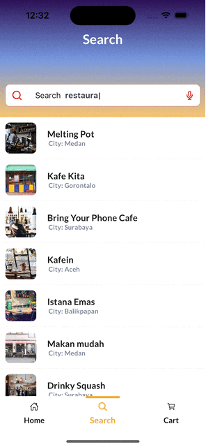
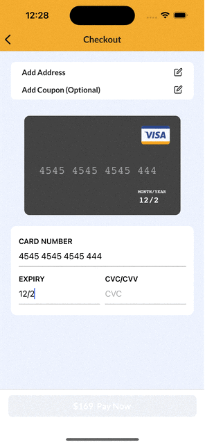
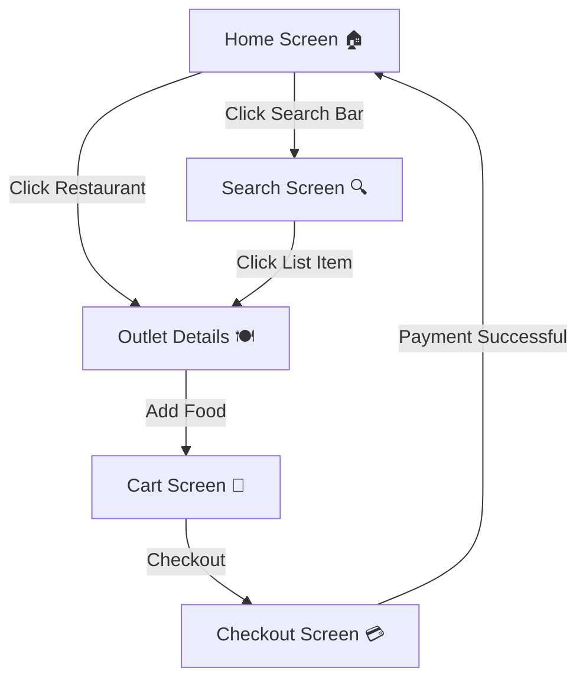

# react-native-restaurantApp

This project is a React Native Food Ordering App, developed as part of the React Native Developer Assignment. The application provides a seamless and engaging experience for users to browse restaurants, search for menu items, and place orders efficiently.


## Table of Contents

- [Features](#features)
- [Demonstration](#demonstration)
- [Folder Structure](#folder-structure)
- [Development Guidelines](#development-guidelines)
- [Testing Guidelines](#testing-guidelines)
- [## 🔀 Navigation Flow](#-navigation-flow)
- [Libraries](#libraries)
- [Supported Devices & OS](#-supported-devices--os)
- [Configuration](#configuration)
- [Installation](#installation)
- [Usage](#usage)
- [Contributing](#contributing)
- [License](#license)

## Features

- Browse restaurant menus
- Place orders
- Make payments
- Voice search
- Animations on all screens
- Bottom tabs navigation
- Cart screen
- Payment screen
- Confirmation screen

## Demonstration

#### Home Screen  


#### Voice Search  


#### Outlet Detail Page with add to cart Button  


#### Payment Flow



### iPhone
[](demo/iphone.mp4)

### Android
[](demo/android.mp4)


## Folder Structure

```
    RestaurantDemo
├── android
├── ios
├── src
│   ├── assets
│   │   ├── fonts
│   │   └── images
│   │   └── Lottie
│   │   └── Svg
│   ├── components
│   │   ├── Bar
│   │   │   └── LabelBar
│   │   ├── Button
│   │   │   ├── CartButton
│   │   │   ├── CartHeaderButton
│   │   │   ├── CartStackButton
│   │   │   ├── RippleButton
│   │   │   └── index
│   │   ├── Card
│   │   │   ├── CartFooterView
│   │   │   └── index
│   │   ├── EmptyView
│   │   ├── Header
│   │   ├── Icon
│   │   ├── Iamges
│   │   ├── Input
│   │   │   ├── SearchBarPlaceHolder
│   │   │   ├── InputDataView
│   │   │   ├── InputRowItem
│   │   │   ├── SearchInput
│   │   │   └── index
│   │   ├── List
│   │   │   └── TopRestaurant
│   │   ├── Modal
│   │   │   ├── BottomModal
│   │   │   ├── ListeningModal
│   │   │   └── BillModal
│   │   ├── RenderItem
│   │   │   ├── CarouselItem
│   │   │   ├── CartItem
│   │   │   ├── MenuItem
│   │   │   ├── OutletItem
│   │   │   ├── SearchItem
│   │   │   └── index
│   │   └── Text
│   ├── Hooks
│   │   ├── useBottomGesture
│   │   ├── useScrollUpTextAnimation
│   │   ├── useStickyHedaer
│   │   └── useTopToBottomAnimation
│   │   └── useVoice
│   ├── routes
│   │   ├── MainStack
│   │   └── Tabs
│   ├── screens
│   │   ├── Home
│   │   │   ├── index.tsx
│   │   │   ├── types.ts
│   │   │   ├── styles.ts
│   │   │   └── useHome.ts
│   │   ├── Search
│   │   │   ├── index.tsx
│   │   │   ├── styles.ts
│   │   │   └── useSearch.ts
│   │   ├── OutletDetail
│   │   │   ├── index.tsx
│   │   │   ├── styles.ts
│   │   │   └── useOutletDetail.tsx
│   │   ├── Cart
│   │   │   ├── index.tsx
│   │   │   └── useCart.ts
│   │   ├── Checkout
│   │   │   ├── index.tsx
│   │   │   ├── styles.ts
│   │   │   └── useCheckout.ts
│   │   ├── Order Confirmation
│   │   │   ├── index.tsx
│   │   │   └── useCart.ts
│   ├── services
│   │   ├── api.ts
│   │   ├── types.ts
│   │   └── endpoints.ts
│   ├── store
│   │   ├── Slices
│   │   │   └── CartSlice.ts
│   │   ├── reducers
│   │   │   └── RestaurantSlice.ts
│   │   ├── storage.ts
│   │   ├── hook.ts
│   │   ├── types.ts
│   │   └── index.ts
│   ├── Themes
│   │   ├── index.ts
│   │   ├── types.ts
│   │   ├── Fonts.ts
│   │   ├── Colors.ts
│   │   ├── Metrics.ts
│   │   ├── Metrics.ts
│   │   ├── Normalized.ts
│   │   └── CommonStyle.ts
│   ├── utils
│   │   ├── strings.ts
│   │   ├── permission.ts
│   │   └── helpers.ts
│   └── App.tsx
├── .gitignore
├── app.json
├── babel.config.js
├── index.js
├── metro.config.js
├── package.json
├── README.md
├── tsconfig.json
└── yarn.lock`
```

## Development Guidelines

### 1. **Linting Rules**
To maintain code consistency, enforce the following linting rules:
- ❌ No **inline styles**
- ✅ Correct **file naming conventions**
- ✅ Proper **import order**
- ✅ React imports
- ❌ No **inline strings** (all text should come from a constants file, `STRINGS`)
- ❌ No **direct numbers** for height, width, padding, fonts (using `Metrics.rfv(size)` or `sizes`)

### 2. **Testing Guidelines**
- Added **testID** for each component so that these feature can be test easily
- Ensure test coverage for **core business logic** and **critical UI elements**.


## 📦 Core Libraries
- **`react` (18.3.1) & `react-native` (0.77.0)**  

  The fundamental libraries for building the React Native application.

## 🚀 Navigation
- **`@react-navigation/native` (7.0.14)**  
  Provides the core navigation functionality.
- **`@react-navigation/bottom-tabs` (7.2.0)**  
  Enables bottom tab navigation for the app.
- **`@react-navigation/native-stack` (7.2.0)**  
  Used for stack-based navigation in the app.
- **`@react-navigation/elements` (2.2.5)**  
  Provides shared elements and UI components for navigation.
- **`react-native-screens` (4.6.0)**  
  Optimizes navigation performance by using native views.
- **`react-native-safe-area-context` (5.2.0)**  
  Ensures proper handling of safe area in different devices.

## 🖼️ UI & Animations
- **`lottie-react-native` (7.2.2)**  
  Provides smooth and lightweight animations for UI enhancement.
- **`react-native-vector-icons` (10.2.0)**  
  Adds scalable vector icons to enhance the UI.
- **`react-native-svg` (15.11.1)**  
  Supports scalable vector graphics for complex UI elements.
- **`react-native-linear-gradient` (2.8.3)**  
  Enables gradient effects in UI components.
- **`react-native-reanimated` (3.16.7)**  
  Optimizes animations for smooth UI interactions.
- **`react-native-reanimated-carousel` (4.0.0)**  
  Provides a high-performance carousel component.

## 📡 API & Data Management
- **`axios` (1.7.9)**  
  Handles HTTP requests to fetch and send data.
- **`@reduxjs/toolkit` (2.5.1) & `redux` (5.0.1)**  
  Manages global state efficiently.
- **`react-redux` (9.2.0)**  
  Connects Redux with React components.
- **`redux-persist` (6.0.0)**  
  Persists Redux state across app reloads.
- **`react-native-mmkv` (3.2.0)**  
  Provides fast and efficient storage for caching data.

## 🌍 API Endpoints

The 📲 uses the following 🔗 from [Dicoding Restaurant API](https://restaurant-api.dicoding.dev):

- **📜 Get All Restaurants**: `GET /list`
- **🔎 Get Restaurant Details**: `GET /detail/:id`
- **🔍 Search Restaurant**: `GET /search?q=:query`

## 📏 Strict Typecasting

The Application 📲 follows ⚛️📜's strict 🛑 to prevent 🐛. Examples of 📑 used:

```tsx
export type Restaurant = {
  id: string;
  name: string;
  description: string;
  pictureId: string;
  city: string;
  rating: number;
};

export type CartItem = {
  id: string;
  name: string;
  price: number;
  quantity: number;
};
```

## 🔊 Voice & Input Handling
- **`@react-native-voice/voice` (3.2.4)**  
  Enables voice recognition features for search or commands.
- **`react-native-credit-card-input` (1.0.0)**  
  Facilitates credit card input and validation for payments.
- **`use-debounce` (10.0.4)**  
  Helps optimize API calls and user input interactions.
- **`react-native-gesture-handler` (2.23.0)**  
  Enhances gesture-based interactions and animations.

## 🖼️ Image Optimization
- **`@d11/react-native-fast-image` (8.9.1)**  
  Optimizes image loading and caching for better performance.

Each of these libraries plays a crucial role in ensuring a seamless user experience, from navigation and UI enhancements to performance optimizations and API integrations.

---

## Configuration ⚙️

### 1. **Navigation Setup** 🚀
- Uses **React Navigation** (`@react-navigation/native`, `@react-navigation/bottom-tabs`, `@react-navigation/native-stack`).
- `NavigationContainer` wraps the app to manage navigation state.
- **Light Theme** (`LightNavigationTheme`) extends the default theme with custom colors.
- **MainNavigator** manages app-wide screens with a **Bottom Tab Navigator** and **Stack Navigator**.

### 2️⃣ **Redux Store Configuration**
The app uses Redux for state management.

```tsx
import {Provider} from 'react-redux';
import {store} from './src/store/index';

<Provider store={store}>
  <RootStack />
</Provider>
```

### 3. **Safe Area & Status Bar** 📱
- Uses `react-native-safe-area-context` for handling device-safe areas.
- `StatusBar` dynamically changes based on dark/light mode.

---

## 🔀 Navigation Flow

### 🏠 **Home Screen**
- Displays a restaurant list.
- Promotional Carousal List
- Vantiene Banner
    - Search Bar Button which navigate to **Search Screen**
    - Lottie Animation
- Clicking on a restaurant navigates to the **Outlet Details** page.

```tsx
<Tab.Screen name="Home" component={Home} />
```

### 🔍 **Search Screen**
- Users can search by typing or voice commands.
- Clicking a list item navigates to **Outlet Details**.
- Includes **sticky header animation** and **empty screen animation**.

```tsx
<Tab.Screen name="Search" component={SearchScreen} />
```

### 🍽️ **Outlet Details Screen**
- Displays food menu.
- Users can add items to the cart.
- **Cart icon** updates with item count.
- **Background image animation**.

```tsx
<Screen name="outletDetail" component={OutletDetail} />
```

### 🛒 **Cart Screen**
- Shows cart items.
- Displays **total bill**, **checkout button**, and **clear cart button**.
- Clicking **checkout** navigates to **Checkout Screen**.

```tsx
<Tab.Screen name="Cart" component={CartScreen} />
```

### 💳 **Checkout Screen**
- Users enter credit card details.
- Validates input before proceeding.
- Users enter delivery address.
- Clicking **Pay Now** clears the cart and returns to **Home Screen**.

```tsx
const handlePayment = () => {
  if (!formData?.valid) {
    Alert.alert("Invalid Card Details", "Please enter valid card information.");
    return;
  }
  if (!address) {
    Alert.alert("Address Required", "Please enter your delivery address.");
    return;
  }
  Alert.alert('Payment Successful', 'Your order has been placed!');
  dispatch(emptyCart());
  navigate('TabStack', {screen: 'Home'});
};
```

---

## 📜 App Flow Diagram



```simpliest verison mermaid
graph TD;
  HomeScreen -->|Click Restaurant| OutletDetail;
  HomeScreen -->|Click Search| SearchScreen;
  SearchScreen -->|Click Item| OutletDetail;
  OutletDetail -->|Add to Cart| CartScreen;
  CartScreen -->|Click Checkout| CheckoutScreen;
  CheckoutScreen -->|Payment Success| HomeScreen;
```

---

## 🔄 User Flow
### 1. **Home Screen 🏠**
- Displays a **restaurant list**.
- Clicking a restaurant navigates to the **Outlet Details** page.
- Bottom **Search Bar** allows navigation to the **Search Screen**.

### 2. **Search Screen 🔍**
- User can **search by typing** or using **voice commands**.
- Clicking a list item navigates to **Outlet Details**.
- Features:
  - Sticky header animation.
  - Card enter animations.
  - Empty state animation.

### 3. **Outlet Details Screen 🍽️**
- Displays restaurant **menu items**.
- User can **add items to the cart**.
- **Cart icon in header** updates with the item count.
- Background image animation.

### 4. **Cart Screen 🛒**
- Displays **list of selected items** from one restaurant.
- Shows **total bill**.
- Buttons: **Checkout** ✅ | **Clear Cart** ❌

### 5. **Checkout Screen 💳**
- Uses **react-native-credit-card-input** for payment.
- Features:
  - **Enter credit card details**.
  - **Enter delivery address**.
  - Alert on **invalid card details**.
  - Alert if **address is missing**.
- Clicking **Pay Now** processes payment and **clears cart**.
- Navigates back to **Home Screen** after payment.

### 6. **Order Confirmation **
- Simple Lottie animation with order confirmation message which disappears after 3sec.

---

### 🎨 Custom Themes & Colors
- Uses a **Light Theme** with a customized color palette from `Colors`.
- Supports **dark mode detection** using `useColorScheme`.

---

## 🏗️ Technologies Used
- **React Native** 📱
- **React Navigation** 🚀
- **Redux Toolkit** 🏗️
- **React-Native-Safe-Area-Context** 📏
- **React-Native-Credit-Card-Input** 💳

---
## 📂 Direct Folder Path Implementation
This project supports **direct path imports**, allowing developers to import components and utilities without relative paths.

---

## 📱 Supported Devices & OS  

This app is compatible with a wide range of devices, ensuring a seamless experience across platforms.

| Device Type      | Supported OS Versions       |
|-----------------|---------------------------|
| iPhone         | iOS 15.1 and later        |
| iPad           | iOS 15.1 and later        |
| Android Phones | Android 7.0 (Nougat) - API 24+ |
| Android Tablets | Android 7.0 (Nougat) - API 24+ |

---

## 🎉 Conclusion
This Food Ordering App provides a seamless user experience with:
- **🔍 Voice-enabled search**
- **🎨 Smooth animations**
- **🛠️ Modular navigation architecture**
- **💳 end to end checkout flow**

---

### Configuration
#### **1️⃣ TypeScript Configuration (`tsconfig.json`)**
```json
{
  "compilerOptions": {
    "baseUrl": "./src",
    "paths": {
      "@components/*": ["components/*"],
      "@screens/*": ["screens/*"],
      "@store/*": ["store/*"],
      "@utils/*": ["utils/*"]
    }
  }
}
```

#### **2️⃣ Babel Configuration (`babel.config.js`)**
```javascript
module.exports = {
  plugins: [
    ['module-resolver', {
      root: ['./src'],
      alias: {
        "@components": "./src/components",
        "@screens": "./src/screens",
        "@store": "./src/store",
        "@utils": "./src/utils"
      }
    }]
  ]
};


```

### 📌 Usage Example
Instead of using:
```tsx
import Button from '../../../components/Button';
```
Use:
```tsx
import Button from '@components/Button';
```
✅ **Cleaner and more maintainable imports!** 🚀


## Installation
1. Clone the repository:
   ```sh
   git clone https://github.com/shivam4ukhandelwal/react-native-restaurantApp.git
   ```
2. Navigate to the project directory:
   ```sh
   cd react-native-restaurantApp
   ```
3. Install dependencies:
   ```sh
   yarn install
   ```
4. Run the project:
   ```sh
   yarn start
   ```

## Usage

1. Start the Metro bundler:
   ```sh
   yarn start
   ```
2. Run the app on an Android or iOS emulator:
   ```sh
   yarn android
   yarn ios
   ```


## License

This project is licensed under the MIT License.
